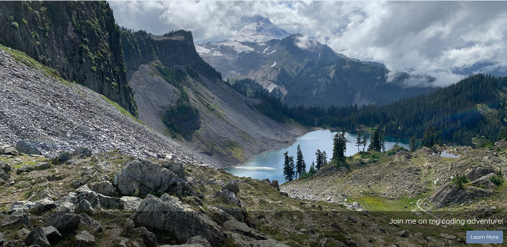
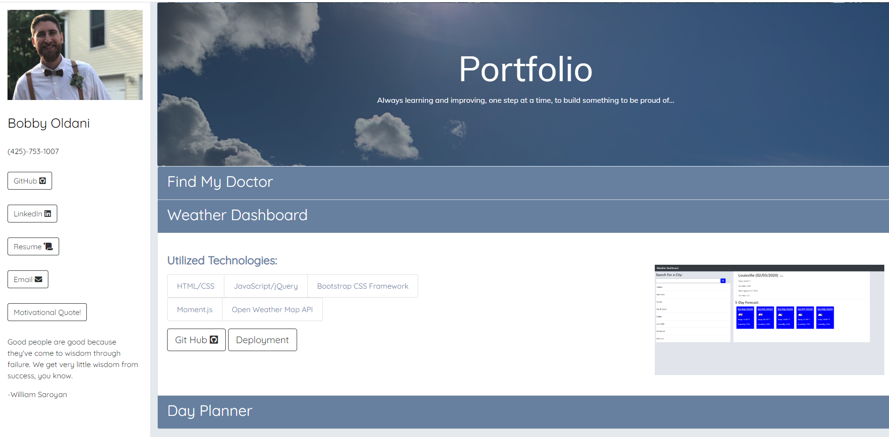

# Coding-Bootcamp-Portfolio

https://bobbyoldani.github.io/Coding-Bootcamp-Portfolio/

## Landing Page:

Simple background image layout with a single button bringing the user to my portfolio.

## Portfolio:

Combination of bootstrap and custom styling I also added a little JavaScript to implement a random quote API

## Issues:

My biggest problem in creating this page was keeping everything readable while also stylish. I wanted to make sure all the colors and text fit the theme. I also wanted to demonstrate my ability to write JavaScript and I had a hard time thinking of ideas in which I could do this which is why I added the random quotes.
